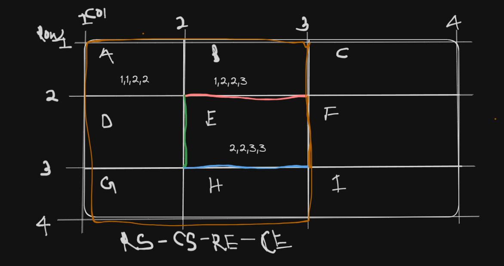

# CSS GRID

- Flexbox is one dimensional
- Grid is two dimensional

## grid-template-columns:

- Defines the columns and rows of the grid with a space-separated list of values.

## grid-template-rows:

- We can also specify height of each row by using
  `grid-template-rows` property

- to get gap between each item, we can use
  `grid-row-gap`
- same goes for `grid-column-gap`

## repeat():

- The
  repeat()
  CSS
  function represents a repeated fragment of the track list,
  allowing a large number of columns or rows that exhibit a recurring pattern to be
  written in a more compact form.

## Syntax :

repeat(no_of_times,size)

- for eg:
  grid-template-columns: 100px 100px can be written as
  `repeat(2,100px)`

## Line based placement:



## Example:

```javascript
#box3 {
  background-color: orange;
  grid-area: 1/2/2/3;
  grid-area: orange;
}
```

## Spanning:

### Definition:

- Spanning allows an item to occupy multiple grid tracks (columns or rows).
- Usage:
- Implemented using the grid-column and grid-row properties on grid items.
- Syntax:
- grid-column: start / end; specifies the start and end grid lines for the item horizontally.
- grid-row: start / end; specifies the start and end grid lines for the item vertically.

### Spanning Multiple Tracks:

- Use the span keyword to indicate how many tracks an item should span.
- Example: grid-column: 1 / span 2; (Item spans 2 columns starting from the first grid line)
- Shorthand:
- Both grid-column and grid-row properties can be combined into a shorthand.
- Example: grid-column: 1 / span 2; grid-row: 1 / span 3;
